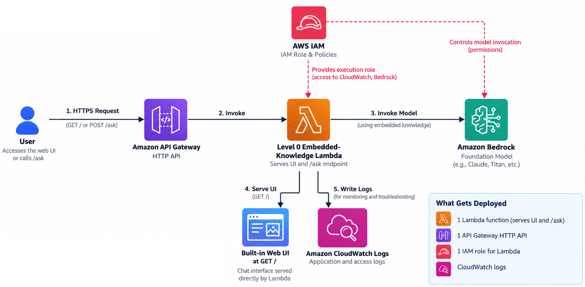

# Level 0: Prompt-Based LLM Demo

## Goal

Provide a **Level 0 teaching demo** by keeping **trusted knowledge directly inside the Lambda function** instead of retrieving it from a knowledge store.

This demonstrates **grounded prompting, not retrieval-augmented generation (RAG)**. Level 1 will then begin with the **S3-backed starter**, because retrieval is part of the architecture at that level.

## Level 0 Assets

- CloudFormation: [Level 0 prompt demo template](../../templates/cloudformation/level-0-llm-prompt-demo.yaml)
- Sample app: [Level 0 prompt demo example](../../examples/level-0-llm-prompt-demo/README.md)
- Architecture: 

## When To Use It

- Intro demos
- Workshops
- Very small fixed knowledge sets
- Early conversations about **prompt grounding** before introducing retrieval

## When Not To Use It

- Frequently changing knowledge
- Larger document sets
- Content owned by multiple teams
- Anything that needs **stronger governance** or **easier updates**

## Rough Daily Cost View

| Service              | Role                               | Rough daily cost                                              |
| -------------------- | ---------------------------------- | ------------------------------------------------------------- |
| AWS Lambda           | Prompt assembly and orchestration  | Less than $0.50                                               |
| API Gateway HTTP API | Public API entry point             | Less than $0.50                                               |
| Amazon CloudWatch    | Logs and basic metrics             | Less than $0.25                                               |
| Amazon Bedrock       | Model inference                    | Roughly $1 to $10 depending on prompt size and request volume |

For a light-use Level 0 deployment, the total daily cost can often stay in roughly the **$1 to $12 range**, with Bedrock usage being the main variable.

That estimate assumes:

- light demo or workshop traffic
- short prompts and responses
- a small fixed knowledge block in the Lambda function
- no external knowledge store or retrieval layer

## How It Works

1. A user **opens the built-in client** at `/start-here`.
2. The user **enters the API key** retrieved from Secrets Manager, or passed in the URL for simplicity.
3. The client **sends the question and API key** to `/ask`.
4. API Gateway validates the key and applies the usage-plan throttle.
5. Lambda **builds a prompt using a fixed knowledge block** and invokes Amazon Bedrock.
6. The app returns the generated answer and identifies that the **prompt-based LLM variant** was used.

## Tradeoffs

- Cheapest and easiest path to understand
- No S3 bucket or retrieval logic required
- Knowledge changes require **code or template redeployment**
- Weakest option for **maintainability** and **content governance**
- The `/ask` route uses an API key and throttling, but this is **not user identity or production authorization**

## Deployment

Deploy [templates/cloudformation/level-0-llm-prompt-demo.yaml](../../templates/cloudformation/level-0-llm-prompt-demo.yaml) with the CloudFormation CLI:

**PowerShell**

```powershell
aws cloudformation deploy `
  --template-file templates/cloudformation/level-0-llm-prompt-demo.yaml `
  --stack-name aws-secure-ai-rag-llm-prompt-demo `
  --capabilities CAPABILITY_NAMED_IAM `
  --parameter-overrides BedrockModelId=us.amazon.nova-lite-v1:0
```

**Bash**

```bash
aws cloudformation deploy \
  --template-file templates/cloudformation/level-0-llm-prompt-demo.yaml \
  --stack-name aws-secure-ai-rag-llm-prompt-demo \
  --capabilities CAPABILITY_NAMED_IAM \
  --parameter-overrides BedrockModelId=us.amazon.nova-lite-v1:0
```

Open the **`AppUrl`** stack output, that already includes the api-key. API Gateway requires it in the **`x-api-key` header only for `POST /ask`**; **`GET /start-here` remains public**.

⚠️ **Warning: Avoid unexpected AWS charges**
**Always delete the CloudFormation stack after use** to avoid recurring charges. After deleting the stack, manually check the related AWS services to confirm that all resources have been successfully removed.

## Troubleshooting

| Issue | Troubleshooting steps |
| --- | --- |
| How to find the app public link | Navigate to the deployed stack in the AWS CloudFormation console, open the **Outputs** tab, and use the `AppUrl` value. |
| Getting an `Operation not allowed` error | Test the configured model manually in the Amazon Bedrock playground to determine whether the same issue occurs outside the application. Confirm that the AWS account's payment method and billing configuration are valid. If the error continues after 15 minutes, open an AWS Support case. |
| Other error | Try with the us-east-1 region. Review the Lambda function's Amazon CloudWatch log group for the detailed error message and request context. |


## Relationship To Level 1

This demo exists to make the **first learning step smaller**. It sits before Level 1 because it has **no retrieval step** and requires **code or template redeployment for knowledge changes**. The **S3-backed starter** is the first Level 1 pattern because it separates application code from knowledge content and performs lightweight retrieval.

[Back to home page](/README.md)
